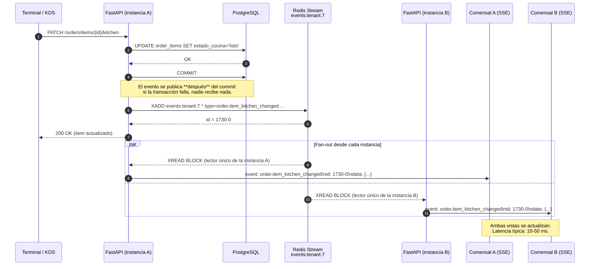
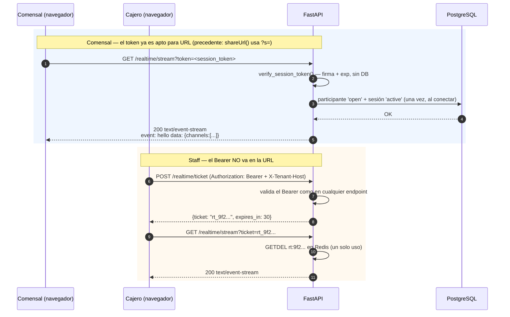
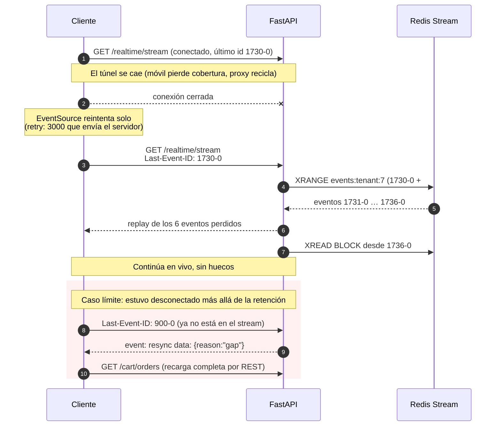

# Tiempo real para el estado de pedidos — propuesta arquitectónica

> **Entregable**: este documento. No se implementa nada todavía (decisión acordada).

## Contexto: lo que hay hoy, medido

Antes de proponer, los hechos del repositorio —varios cambian las conclusiones habituales:

| Hecho | Dónde | Por qué importa |
|---|---|---|
| **Una sola instancia** de uvicorn, **sin `--workers`** | `docker-compose.prod.yml`; `grep --workers` → 0 resultados | Hoy no hay problema de fan-out entre procesos. El bus solo hace falta cuando escales. |
| Redis ya está, como **dependencia dura de arranque** | `app/core/redis.py`; `main.py:50-57` hace `ping()` y `raise` | El bus no añade infraestructura nueva. |
| Celery existe pero **solo para un email** | `app/celery_task.py`; único uso en `admin/router.py:36` | No es un bus de eventos ni conviene convertirlo en uno. |
| **Toda la DB es síncrona** bajo FastAPI async | `create_engine` + `Session` en `core/db.py` | Un handler de larga vida **no puede** llamar a `with_db` en línea. Precedente: `anyio.to_thread.run_sync` (`scheduler.py:197`). |
| `echo=True` **en producción** | `core/db.py:26` | Cada SQL de cada sondeo se escribe en el log. |
| Cada request del comensal hace **UPDATE + COMMIT** | `qr_context.py:170-171` (TTL deslizante) | Sondear = escribir en Postgres. Es el coste que peor escala. |
| El comensal se autentica por **cabecera** `x-session-token` | `auth-token.interceptor.ts:43-49` | `EventSource` y `WebSocket` **no pueden enviar cabeceras**. |
| **No hay cookies**: el token viaja en el JSON | `diner-token.store.ts:14-18` | Descarta la vía "cookie same-origin" para autenticar el stream. |
| Frontend y API en **orígenes distintos** | `environment.ts`: `api.skeilopos.com` vs `<tenant>.skeilopos.com` | CORS y cookies cross-site entran en juego. |
| La config de Nginx **no está versionada** | No existe en el repo ni en los hermanos | `proxy_buffering` y `proxy_read_timeout` son decisivos para SSE/WS y hoy nadie los controla. |
| No existe nada de tiempo real | 0 resultados de `websocket|EventSource|StreamingResponse` | Campo libre. |

Sondeos activos hoy, todos a 10 s:

| Cliente | Endpoint(s) | Coste por tick |
|---|---|---|
| Menú QR (comensal) | `GET /cart/orders` | ~5 SELECT + 1 UPDATE + COMMIT |
| Terminal de mesas (cajero) | `GET /orders` + `GET /orders/tables` | **todos los pedidos del tenant**, sin filtro |
| KDS | `GET /orders` | ídem |

---

## 1. ¿Duele hoy? Los números

Un sondeo de comensal = 0,1 req/s. Cada uno arrastra ~6 sentencias SQL y **una escritura**.

| Concurrentes | req/s | queries/s | **escrituras/s** | Veredicto con la arquitectura actual |
|---|---|---|---|---|
| 100 | 10 | ~60 | 10 | Sobrado. Ni se nota. |
| 1.000 | 100 | ~600 | 100 | Empieza a doler: 100 escrituras/s son **puro TTL**, no negocio. `echo=True` escupe ~600 líneas de log/s. |
| 5.000 | 500 | ~3.000 | 500 | Roto. Un proceso, un event loop, pool de SQLAlchemy sin dimensionar (5+10 por defecto). |
| 20.000 | 2.000 | ~12.000 | 2.000 | Inviable sin rediseño completo. |
| 100.000 | 10.000 | ~60.000 | 10.000 | Fuera de alcance. |

**El cuello no es HTTP, es Postgres** — y sobre todo las escrituras del TTL deslizante, que no aportan nada al negocio.

Contraste con push: una mesa de 4 comensales genera ~15-20 cambios de estado **en toda su vida** (≈1 h). Eso es 0,005 eventos/s por mesa, frente a 0,4 req/s de esos mismos 4 comensales sondeando: **~80× menos trabajo**. Y el trabajo por evento es O(comensales de esa mesa) ≈ 4, no O(clientes conectados).

**Conclusión honesta**: con tu escala real (3 tenants, 4 mesas) el polling no es un problema hoy. Migrar es correcto *antes* de crecer, pero el orden importa — ver Fase 0.

---

## 2. Fase 0: lo que haría antes de migrar nada

Cuatro arreglos, ~1 día, sin tocar la arquitectura. Multiplican por ~10 la capacidad y **hay que hacerlos igual**, porque el push no los sustituye:

1. **`echo=False` en producción** (`core/db.py:26`). Hoy cada SQL de cada sondeo se serializa a texto y se escribe. Es probablemente el mayor coste por request.
2. **TTL deslizante perezoso** (`qr_context.py:170-171`). Refrescar `expires_at` solo si queda menos de la mitad de la ventana; hoy es un `UPDATE`+`COMMIT` por cada lectura. Elimina el 100 % de las escrituras del sondeo.
3. **ETag / `304 Not Modified`** en `GET /cart/orders` y `GET /orders`. El 95 % de los sondeos devuelven exactamente lo mismo; un 304 ahorra serialización y ancho de banda, no las queries.
4. **Pausar el sondeo con la pestaña oculta** (`document.visibilityState`) en los cuatro `setInterval`. Un comensal con el móvil en el bolsillo hoy sigue sondeando.

Con esto, el escenario de 1.000 concurrentes pasa de "incómodo" a "cómodo", y compras tiempo para hacer la migración sin prisa.

---

## 3. Evaluación de transportes

No doy por hecho WebSockets. Las cuatro opciones reales, contra **este** sistema:

### Polling (lo actual)
- ✅ Cero complejidad; ya funciona; sobrevive a cualquier proxy.
- ❌ Coste O(clientes × frecuencia) independientemente de si hay novedades. Latencia media = medio intervalo (5 s).

### Long-polling
- ✅ Latencia casi inmediata sin protocolo nuevo.
- ❌ **Peor que SSE en todo**: mantiene una conexión abierta igual, pero paga el ciclo completo de request/response en cada evento, y en Python síncrono bloquea un worker por cliente en espera. Descartado.

### Server-Sent Events (SSE)
- ✅ **Unidireccional servidor→cliente, que es exactamente el flujo**: el comensal nunca envía nada por el canal; sus pedidos van por `POST` REST.
- ✅ HTTP/1.1 plano: no hay upgrade de protocolo, atraviesa proxies con `proxy_buffering off`.
- ✅ **Reconexión automática y replay integrados en el navegador**: `EventSource` reintenta solo y reenvía `Last-Event-ID`. Con WebSockets eso hay que escribirlo a mano.
- ✅ Cero dependencias nuevas (`StreamingResponse` de FastAPI).
- ✅ Sobre HTTP/2 se multiplexa; el límite de 6 conexiones por origen de HTTP/1.1 no aplica (y con una pestaña por comensal, tampoco molestaría).
- ❌ No puede enviar cabeceras en el handshake → el token va en la query string.
- ❌ Solo texto (irrelevante aquí: JSON).

### WebSockets
- ✅ Bidireccional, binario, menor overhead por mensaje.
- ❌ **Nada de eso se necesita**: no hay mensajes cliente→servidor en este flujo.
- ❌ Reconexión, backoff, heartbeat y replay: **todo a mano**.
- ❌ Más superficie de proxy (upgrade, timeouts) sobre una config de Nginx que no está versionada.
- ❌ Mismo problema de cabeceras que SSE, sin ninguna ventaja compensatoria.

### **Recomendación: SSE**

Para un flujo unidireccional, SSE da el 100 % del beneficio con una fracción del código y del riesgo operativo. WebSockets sería la elección correcta el día que aparezca tráfico cliente→servidor con estado (chat con el mesero, colaboración en el pedido, comandas por voz). Ese día se migra: el diseño de canales y eventos que propongo abajo **no cambia**, solo el transporte.

---

## 4. Escenarios de carga con SSE

El coste deja de ser por-request y pasa a ser **memoria por conexión ociosa** + **CPU por evento**.

| Concurrentes | Memoria (≈30 KB/conn) | Procesos necesarios | Notas |
|---|---|---|---|
| 100 | ~3 MB | 1 | Trivial. Ni se nota frente al polling actual. |
| 1.000 | ~30 MB | 1 | Un solo proceso Python sobra. |
| 5.000 | ~150 MB | 1-2 | Un event loop aguanta; conviene subir `ulimit -n` y el pool de Postgres. |
| 20.000 | ~600 MB | 4-8 (`--workers`) | Aquí **empieza a hacer falta el bus**: cada worker solo ve a sus conectados. |
| 100.000 | ~3 GB | 16-32, en 2-4 nodos | Nginx con `worker_connections` alto; Redis Streams como bus; sin estado en el proceso. |

El dato que hace viable el salto: **los eventos son rarísimos comparados con las conexiones**. 20.000 comensales conectados generan del orden de 30-100 eventos/s en total, y cada uno se entrega a ~4 destinatarios. Eso es ruido para Redis y para el event loop. Lo que se dimensiona son sockets ociosos, no throughput.

---

## 5. Flujo de eventos

### Escenario completo: la cocina marca un ítem como listo



Puntos que hacen que esto sea correcto y no solo rápido:

- **Publicar después del `COMMIT`**, nunca dentro de la transacción. Si el commit falla, no puede haber salido un evento que anuncie algo que no ocurrió.
- **Un lector por instancia**, no por conexión. Cada proceso mantiene **una** conexión Redis con `XREAD BLOCK` sobre el stream del tenant y reparte en memoria a sus suscriptores locales por `asyncio.Queue`. Con 20.000 conexiones repartidas en 8 procesos, Redis ve 8 lectores, no 20.000.
- **Postgres sigue siendo la fuente de verdad.** El evento es una *notificación*, no el dato. Un cliente que dude siempre puede re-consultar por REST.

### Conexión y autenticación



El **ticket de un solo uso** para el staff es la pieza que evita el problema real: un `Authorization: Bearer` en la query string acaba en los logs de Nginx, en el historial y en el `Referer`. El ticket vive 30 s, se consume con `GETDEL` y solo sirve para abrir el stream.

### Reconexión y recuperación de eventos perdidos



Esto es lo que decide **Redis Streams sobre Pub/Sub**: el id del evento SSE *es* el id del stream, así que `Last-Event-ID` —que el navegador envía solo— se traduce en un `XRANGE` exacto. El replay sale gratis. Con Pub/Sub habría que construir un buffer aparte.

Retención: `XADD ... MAXLEN ~ 1000` por tenant. Cubre horas de operación normal; más allá, el `resync` es una salida honesta y explícita en vez de un hueco silencioso.

---

## 6. Escalabilidad horizontal: el bus

El problema: un evento nace en la instancia A y hay clientes conectados a la B.

| Opción | A favor | En contra | Veredicto |
|---|---|---|---|
| **Redis Pub/Sub** | Ya está. Trivial. Latencia mínima. | **Sin persistencia**: lo que se emite mientras no hay suscriptor se pierde. No hay replay para `Last-Event-ID`. | Válido, pero obliga a construir el buffer de replay aparte. |
| **Redis Streams** ⭐ | Ya está. **Persistente y con ids ordenados** → `Last-Event-ID` = `XRANGE`, replay gratis. `MAXLEN` acota la memoria. Un lector por instancia. | Ligeramente más código que Pub/Sub. Retención finita (deseable aquí). | **Elegido.** |
| **RabbitMQ** | Enrutado potente, colas durables, ack por consumidor. | Un servicio más que operar, monitorizar y actualizar. Su modelo (colas de trabajo) no encaja con fan-out a N lectores efímeros. | Redundante con Redis ya presente. |
| **Kafka** | Retención larga, throughput enorme, replay por offset. | JVM, particiones, rebalanceos. Complejidad desproporcionada para ~50 eventos/s. Coste de VPS considerable. | Descartado. Sería la respuesta correcta a otra pregunta. |
| **NATS (JetStream)** | Binario diminuto, latencia excelente, JetStream da persistencia y replay. Técnicamente el más elegante. | **Un servicio más** en un Docker Compose de VPS único, para lograr lo que Redis ya hace. | Sería mi elección si Redis no estuviera. Como está: no. |

**Decisión: Redis Streams**, un stream por tenant (`events:tenant:{id}`), con filtrado por canal en el proceso. Un stream por *mesa* fragmentaría demasiado (`XREAD` sobre un conjunto de claves cambiante); por tenant el volumen es bajísimo y el filtrado en memoria es gratis.

**Sticky sessions: no hacen falta.** Es una consecuencia del diseño y conviene subrayarlo: como el estado de suscripción se deriva del token en cada conexión y los eventos vienen de Redis, **cualquier instancia puede atender a cualquier cliente**. El balanceador puede repartir a ciegas. Solo se necesita:
- `proxy_buffering off` y `proxy_cache off` en la ruta del stream (si no, Nginx acumula y no entrega nada);
- `proxy_read_timeout` mayor que el heartbeat (60 s por defecto → heartbeat cada 20 s);
- `X-Accel-Buffering: no` en la respuesta, como cinturón por si el proxy no está configurado.

---

## 7. Diseño del transporte

### Canales

| Canal | Quién | Qué recibe |
|---|---|---|
| `t:{tenant}:session:{table_session_id}` | Comensal | Solo lo de **su** sesión de mesa. |
| `t:{tenant}:staff` | Cajero, KDS | Todo el tenant: pedidos nuevos, cocina, cobros, mesas. |

La suscripción **se deriva del token, nunca se pide**. Un comensal no puede pedir el canal de otra mesa porque su `table_session_id` viene firmado en el JWT (`ts` claim). Es la misma propiedad que ya protege `GET /cart/orders`.

### Ciclo de vida de una conexión

- **Heartbeat**: comentario SSE `: ping` cada 20 s. Mantiene vivo el túnel y detecta el otro extremo muerto.
- **Vida máxima**: 30 min por conexión; al vencer, el servidor cierra limpiamente y `EventSource` reconecta solo, revalidando el token. Evita sockets inmortales con credenciales viejas — que es el punto débil clásico de WebSockets con JWT.
- **Backpressure**: cola acotada por cliente (p. ej. 100 eventos). Si se llena, se descarta al cliente con `resync` en vez de acumular memoria.
- **Desconexión**: al cerrarse el generador, se elimina la cola del registro en memoria. No hay estado que limpiar en Redis.
- **TTL del comensal**: la conexión **no** refresca el TTL deslizante. Si lo hiciera, una pestaña olvidada mantendría la sesión viva indefinidamente. El TTL lo siguen moviendo las llamadas REST reales (pedir, cancelar).

### Concurrencia con la DB síncrona

La validación al conectar debe ir por `anyio.to_thread.run_sync`, como ya hace el scheduler (`scheduler.py:197`). **Nunca** mantener abierta una `Session` durante la vida del stream: pinaría una conexión de Postgres durante horas. Se valida al conectar y se suelta.

---

## 8. Catálogo de eventos

Principio: **eventos delgados**. Llevan ids y lo que cambió, no el objeto completo. Así el bus se mantiene pequeño, no se filtra información entre canales, y el cliente decide si le basta el evento o necesita re-consultar. `v` es una versión monótona por entidad para descartar eventos fuera de orden.

```jsonc
// order.created — el comensal envió su carrito (status 'recibida')
{ "type":"order.created", "v":1, "at":"2026-08-01T14:03:11Z",
  "table_session_id":"a861...", "dining_table_id":"6dff...", "table_number":1,
  "order_id":"0d0f...", "customer_name":"Ana", "items_count":3, "total":"24000" }

// order.confirmed — el staff lo aceptó: 'recibida' → 'abierta' (descuenta inventario)
{ "type":"order.confirmed", "v":2, "at":"...", "order_id":"0d0f...",
  "table_session_id":"a861...", "status":"abierta" }

// order.item_kitchen_changed — el evento más frecuente
{ "type":"order.item_kitchen_changed", "v":5, "at":"...",
  "order_id":"0d0f...", "table_session_id":"a861...",
  "item_id":"7c1e...", "estado_cocina":"listo" }

// order.item_voided — anulación de una línea
{ "type":"order.item_voided", "v":6, "at":"...",
  "order_id":"0d0f...", "item_id":"7c1e...", "motivo":"Sin stock",
  "replacement_item_id": null }

// order.cancelled
{ "type":"order.cancelled", "v":7, "at":"...", "order_id":"0d0f...",
  "table_session_id":"a861...", "motivo":"Cliente se retiró" }

// session.bill_changed — OJO: el cliente marca la cuenta como obsoleta, NO la recarga (§9)
{ "type":"session.bill_changed", "v":8, "at":"...",
  "table_session_id":"a861...", "total":"32000" }

// payment.completed — una venta emitida (en split llega una por comensal)
{ "type":"payment.completed", "v":9, "at":"...",
  "table_session_id":"a861...", "sale_id":"3b9a...",
  "invoice":{"prefix":"","number":9}, "total":"12000",
  "customer_name":"jose", "billing_mode":"split" }

// session.closed — la mesa se cobró y cerró
{ "type":"session.closed", "v":10, "at":"...",
  "table_session_id":"a861...", "dining_table_id":"6dff...",
  "reason":"paid" }   // paid | swept | released

// table.status_changed — pinta el tablero del cajero
{ "type":"table.status_changed", "v":11, "at":"...",
  "dining_table_id":"6dff...", "table_number":1, "status":"libre" }

// resync — control: el cliente debe recargar por REST
{ "type":"resync", "reason":"gap" }   // gap | backpressure | schema_change
```

Los eventos de control (`hello`, `ping`, `resync`) van fuera del catálogo de negocio y no se persisten en el stream.

---

## 9. Tres trampas del código actual

Cualquier diseño push tiene que respetarlas; las tres son bugs reales que ya costaron sesiones de depuración en este proyecto:

1. **La campana de pedidos nuevos deduplica por id, no por contador.** `newPendingIds(seen, orders)` (`pos-terminal.store.ts:91-93`) existe porque un pedido que entra y se confirma dentro de la misma ventana debe sonar igual. Si el push alimenta esa lógica sin pasar por el mismo `Set`, **la campana sonará dos veces en cada replay tras reconectar**.

2. **La cuenta de la mesa está deliberadamente fuera del sondeo.** `startPolling()` recarga pedidos y mesas pero **no** `sessionBill`, porque `SessionBillPanelComponent.ngOnChanges` resetea el método de pago y el efectivo recibido cada vez que cambia la identidad del objeto `bill`. Un `session.bill_changed` que recargue la cuenta **le borra al cajero lo que está tecleando**. El evento debe marcarla obsoleta y ofrecer un botón "actualizar", nunca recargarla solo.

3. **El KDS escribe optimista.** `advance()` parchea `estado_cocina` localmente tras el `PATCH`. Un evento que llegue a la vez puede revertirlo visualmente. Se resuelve descartando eventos con `v` menor o igual al último aplicado, y respetando el guard `busy` por ítem.

---

## 10. Seguridad

| Vector | Mitigación |
|---|---|
| **Autenticación del comensal** | JWT firmado (`verify_session_token`, `qr_token.py:123`), sin estado y sin DB. El tenant viaja en el claim `t`, la mesa en `tb`, la sesión en `ts`. Ya es el mecanismo en producción; el stream no inventa uno nuevo. |
| **Token en la query string** | Aceptable para el comensal —ya existe el precedente `?s=` de `shareUrl()`— y su alcance es una mesa durante horas. **Para el staff no**: ticket de un solo uso de 30 s (`GETDEL` en Redis), para que el Bearer no acabe en logs ni en el `Referer`. |
| **Validación de sesión** | Al conectar: participante `open` **y** sesión `active`, con la misma cadena de 5 pasos de `open_session_context` (`qr_context.py:108-117`). Revalidación forzada cada 30 min por el corte de vida máxima. |
| **Expiración** | El `exp` del JWT (24 h) corta el handshake. El TTL deslizante (4 h) **no** se refresca desde el stream, a propósito: una pestaña olvidada no debe mantener viva una mesa. |
| **Autorización** | El canal se deriva del token, no se solicita. Es imposible suscribirse a otra mesa u otro tenant. Los eventos de staff no viajan nunca por el canal del comensal (por eso van en canales distintos y no en uno filtrado en cliente). |
| **Conexiones masivas** | Reutilizar `rate_limit.enforce()` (`core/rate_limit.py`, INCR+EXPIRE) con un bucket `realtime_connect` por IP y por mesa. Además: máximo de conexiones simultáneas por `table_session_id` (p. ej. 8 — una mesa no tiene 50 comensales) y por IP. |
| **Agotamiento de recursos** | Cola acotada por cliente + vida máxima de conexión + `MAXLEN` en el stream. Ninguna estructura crece sin techo. |
| **Fuga entre tenants** | Un stream por tenant y el `tenant_id` firmado en el token. El mismo aislamiento por schema que ya tiene el resto del sistema. |
| **Abuso del reconnect** | El `retry:` que envía el servidor fija el backoff del navegador (3 s). Ante 429 o 401, el cliente deja de reintentar y cae al flujo de "vuelve a escanear el QR" que ya existe (`DinerSessionExpiredError`). |

---

## 11. Hoja de ruta y criterios de decisión

| Fase | Qué | Cuándo hacerla |
|---|---|---|
| **0** | Los cuatro arreglos de §2 (`echo=False`, TTL perezoso, ETag/304, pausa por visibilidad) | **Ya.** Son correctos con o sin push. |
| **1** | SSE + Redis Streams para el **comensal** (`GET /cart/orders` deja de sondearse) | Cuando el sondeo del menú QR moleste, o antes de la primera campaña de marketing. Es el caso de mayor volumen y el más simple de aislar. |
| **2** | SSE para **staff** (terminal + KDS), con ticket de un solo uso | Después de la 1, reutilizando el 90 % del código. Aquí está el mayor ahorro por cliente: hoy cada terminal se trae *todos* los pedidos del tenant cada 10 s. |
| **3** | `--workers N` + el bus haciendo su trabajo real entre procesos | Cuando un proceso pase de ~5.000 conexiones o la CPU del contenedor supere el 60 % sostenido. |
| **4** | Varias instancias/nodos, Nginx dimensionado, `ulimit` y pool de Postgres | Por encima de ~20.000 concurrentes. |

**Señales para pasar de fase** (no lo hagas por intuición): p95 de latencia percibida > 3 s; CPU sostenida > 60 %; conexiones de Postgres cerca del límite del pool; o coste de VPS creciendo más rápido que los tenants.

**Lo que NO haría**: introducir Kafka o RabbitMQ; poner el estado de suscripción en memoria del proceso (obliga a sticky sessions y bloquea el escalado); o migrar a WebSockets sin un caso de uso cliente→servidor que lo justifique.

---

## Verificación (cuando se implemente)

1. **Carga**: script con N `EventSource` simultáneos (o `k6`/`vegeta` sobre `text/event-stream`) midiendo memoria del contenedor y latencia evento→recepción a 100 / 1.000 / 5.000 conexiones.
2. **Replay**: conectar, matar la conexión, generar 5 eventos, reconectar y comprobar que `Last-Event-ID` los recupera todos y en orden.
3. **Hueco**: forzar `MAXLEN` pequeño, desconectar, generar más eventos que la retención, reconectar y comprobar que llega `resync` y el cliente recarga por REST.
4. **Aislamiento**: con el token de la mesa 1, comprobar que no llega ningún evento de la mesa 2 ni de otro tenant.
5. **Las tres trampas de §9**: que la campana no suene dos veces tras reconectar; que un `session.bill_changed` no borre el efectivo tecleado; que el KDS no revierta su escritura optimista.
6. **Proxy**: verificar `proxy_buffering off` y que el heartbeat de 20 s mantiene viva la conexión más allá del `proxy_read_timeout`.
